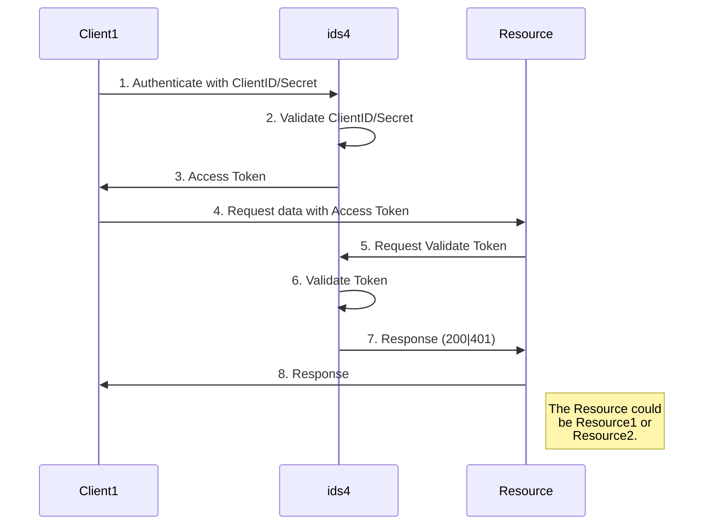
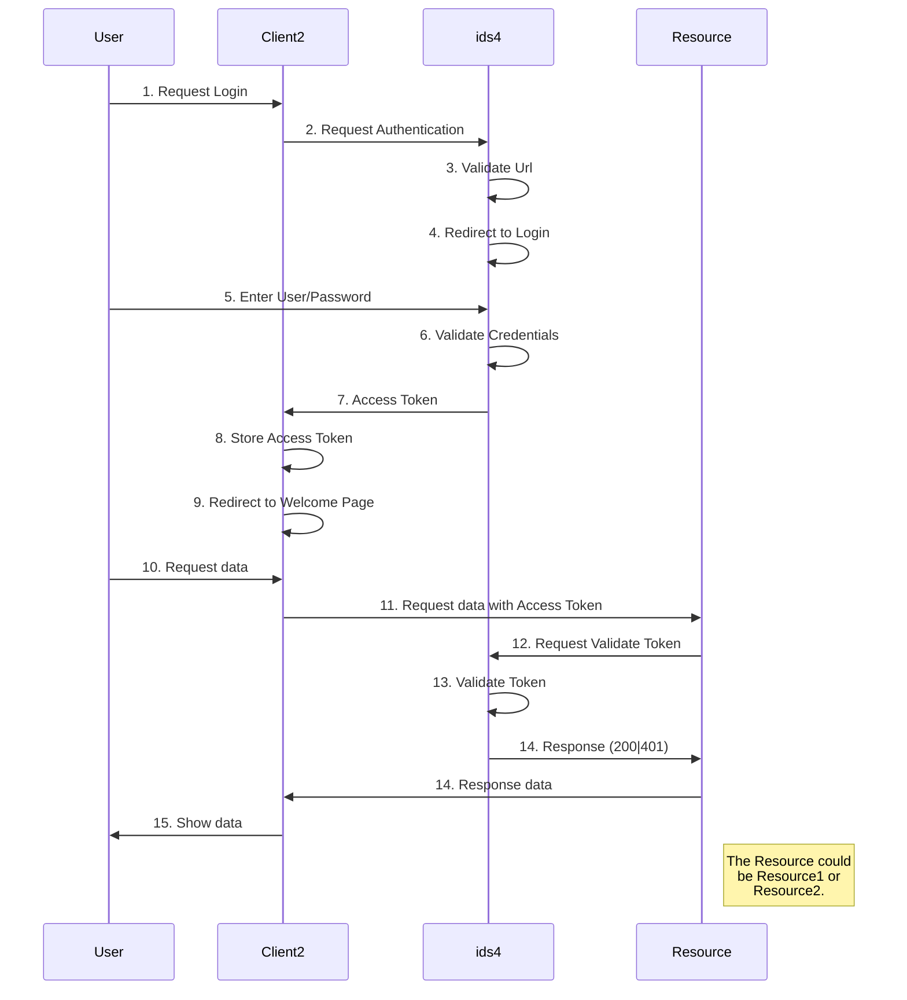

# IdentityServer4 Examples

In the following examples we're going to show how identity server interact with different technologies through different grant types:
 - Client Credencial flow
 - Implicit flow
 - .NET Core and Java Spring Boot services as resourcers

## Folders

This example contains two resources:

 1. Resource1: API Rest service  -.NET Core 2.2 
 2. Resource2: API REST service - Java Srping Boot 2.1.6
 
 This example contains two clients:
 
 1. Client1: Console Application .NET Core 2.2
 2. Client2: Angular 8
 
 This example contains one Security Token Service (ids4)

## Client Credential flow

Sequence Diagram for Client Credentian flow:

## Implicit flow
Sequence diagram for Implicit flow:
